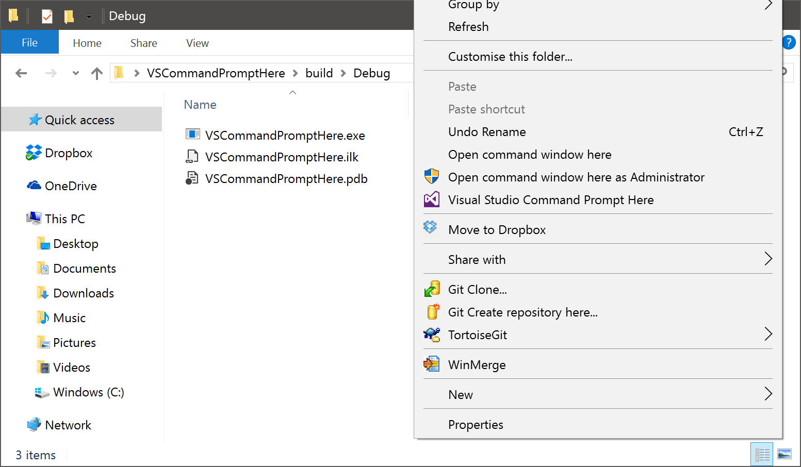

Visual Studio Command Prompt Here
=================================

Provides a context menu entry for directories that opens the Developer Command Prompt for Visual Studio. Inspired by <https://github.com/kzu/CommandPromptHere>, with the main difference being that this tool automatically detects the newest version of Visual Studio that is installed, without requiring the user to create a context menu for each individual version.

Grab the latest build from the **[releases page](https://github.com/adamrehn/VSCommandPromptHere/releases)**.

Works with Visual Studio 2012 and newer.




Installation
------------

Simply place the file `VSCommandPromptHere.exe` in a directory of your choosing, and run

```
VSCommandPromptHere.exe --install
```

and then click through the prompts to allow the registry keys to be added.


Uninstallation
--------------

Simply run

```
VSCommandPromptHere.exe --uninstall
```

and then click through the prompts to allow the registry keys to be removed.


Updating the context menu entry icon
------------------------------------

Although the newest version of Visual Studio is detected at runtime every time the context menu entry is clicked, the icon path for the context menu entry is hard-coded to the executable for the newest detected version of Visual Studio when the registry entries are installed. If you install a new version of Visual Studio and remove the previously installed one, the icon path will be invalid. To fix this, simply run the `--install` option again, and the registry entries will be updated to reflect the new configuration.
